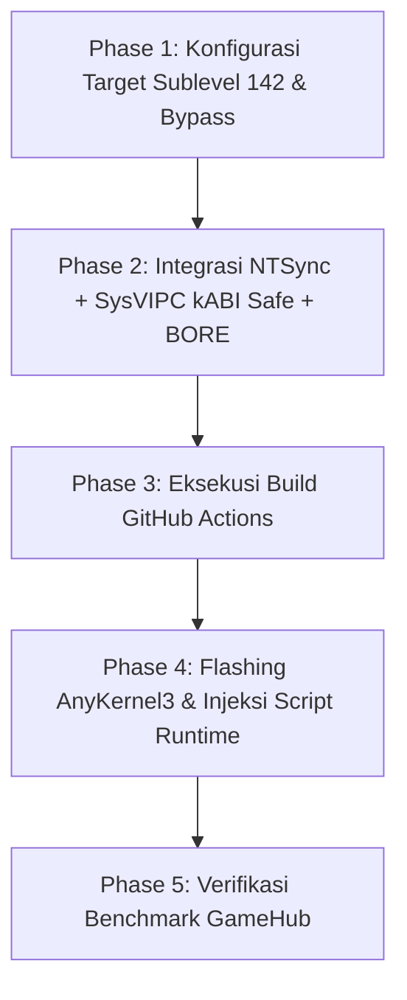

# WORKPLAN: Optimasi Kernel GKI 6.6 untuk Lenovo Legion Y700 Gen 4 (TB322FC)
**Target Utama:** Windows PC Emulation (GameHub, Winlator, FEX-Emu, Box64) & Kinerja Maksimal Hardware Snapdragon 8 Elite (SM8750).

---

## 1. Profil Perangkat & Target Lingkungan Riil

Berdasarkan data langsung dari tablet:
- **String Kernel Saat Ini:** `6.6.142-android15-9-g74744866 #1 Mon Sep 29 01:45:33 CST 2025`
- **Model / Codename:** Lenovo Legion Y700 Gen 4 (2025) / TB322FC
- **Platform SoC:** Qualcomm Snapdragon 8 Elite (`sm87xx` / platform `sun`)
- **Arsitektur CPU:** Qualcomm Oryon (2x Prime Cores @ 4.32 GHz + 6x Performance Cores @ 3.53 GHz, ARMv9.2-A, *tanpa Little Cores*)
- **GPU:** Qualcomm Adreno 830 (Mesa Turnip Vulkan Driver di GameHub)
- **RAM / Storage:** LPDDR5X (9600 Mbps) & UFS 4.0 High-Speed Storage
- **Struktur Boot:** Android Boot Header v4, Page Size 4096 (4KB)
- **Base Branch GKI:** `android15-6.6` (Sublevel: **142**, KMI Generation: **android15-9**)
- **Root & Stealth:** KernelSU-Next + SUSFS (`susfs4ksu`)

---

## 2. Fact-Checking & Hasil Audit Konfigurasi GKI 6.6

| Konfigurasi | Status di GKI 6.6 | Analisis Teknis & Aksi |
|---|---|---|
| **`CONFIG_NTSYNC=y`** | ⚠️ **Perlu Patch (Out-of-tree)** | **SANGAT PENTING.** Menggantikan wineserver IPC lambat dengan driver `/dev/ntsync` langsung di kernel. Repositori memiliki aksi `.github/actions/ntsync` dengan patch untuk `android15-6.6`. *(Catatan: izin `/dev/ntsync` wajib `chmod 666` agar GameHub tanpa root bisa mengakses).* |
| **`CONFIG_FUTEX2=y`** | ❌ **TIDAK ADA / INVALID (Mitos)** | Pada Linux 6.6, **tidak ada opsi kconfig bernama `CONFIG_FUTEX2`**. Syscall `futex_waitv()` (Proton Fsync) sudah resmi menjadi bagian dari **`CONFIG_FUTEX=y`** sejak Linux 5.16. `CONFIG_FUTEX=y` **sudah aktif secara bawaan** di GKI 6.6. |
| **`CONFIG_USERFAULTFD=y`** | ✅ **SUDAH AKTIF (Default)** | Sudah aktif secara bawaan di `arch/arm64/configs/gki_defconfig` AOSP Android 15 untuk ART Garbage Collector. |
| **`CONFIG_ARM64_4K_PAGES=y`** | ⚠️ **KRUSIAL (Wajib Terkunci)** | Wajib memastikan mode halaman 4KB tetap aktif (bukan 16KB), agar emulator x86/x86_64 (Box64, FEX-Emu) berjalan 1:1 tanpa overhead emulasi tabel memori. |
| **`CONFIG_SYSVIPC=y` & `CONFIG_POSIX_MQUEUE=y`** | 🚨 **NONAKTIF di GKI (Bahaya KMI!)** | Dibutuhkan Wine untuk shared memory (`shmget`/`shmat`). **Peringatan keras:** Mengaktifkan flag ini secara mentah merusak layout memori `task_struct`, memicu bootloop pada modul vendor Qualcomm (`kgsl.ko`, audio, WiFi). <br>👉 **Solusi:** Wajib memakai patch Droidspaces (`001.GKI-below-6.12-fix_sysvipc_kabi_6_7_8.patch`) yang memindahkan struct IPC ke slot kosong `ANDROID_KABI_RESERVE`. |
| **`CONFIG_CROSS_MEMORY_ATTACH=y`** | ✅ **SUDAH AKTIF (Default)** | Syscall `process_vm_readv` & `process_vm_writev` aktif bawaan di kernel arm64 dengan MMU. |
| **`CONFIG_DMABUF_HEAPS=y`** | ✅ **SUDAH AKTIF (Default)** | Core DMA-BUF Heaps aktif. Alokasi memori grafis dikelola driver Qualcomm vendor (`/dev/dma_heap/system` atau `qcom,system`). |
| **`CONFIG_SYNC_FILE=y`** | ✅ **SUDAH AKTIF (Default)** | Eksplisit sync fence aktif untuk rendering grafis Vulkan. |
| **Kernel Vermagic Bypass** | ⚠️ **Wajib Diaktifkan (`bypass: true`)** | Mem-patch `bad_version` pada loader modul kernel agar modul vendor Lenovo TB322FC (berlabel `6.6.142-android15-9-g74744866`) tetap berhasil dimuat tanpa konflik vermagic hash. |

---

## 3. Matriks Tweak & Optimasi Tambahan Khusus GameHub

Untuk memaksimalkan performa emulator PC pada hardware Snapdragon 8 Elite Lenovo Y700 Gen 4:

### A. Level Kernel (Compile-Time)
1. **CPU Scheduler - BORE (Burst-Oriented Response Enhancer):**
   - Masalah di GameHub: Thread kompilasi JIT Box64/FEX yang berat sering membuat thread rendering game (DirectX/Vulkan) dan thread audio mengalami *starvation* (stuttering/frame drop).
   - Solusi: Integrasi patch scheduler BORE untuk memprioritaskan latensi thread interaktif tanpa mengorbankan throughput JIT.
2. **I/O & Filesystem Tweaks (UFS 4.0 & F2FS):**
   - Menerapkan `f2fs_reduce_congestion.patch` (mengurangi kemacetan fsync saat menulis shader cache DXVK).
   - I/O Queue: Multi-queue block layer (`blk-mq`) dengan scheduler `none` atau `mq-deadline` (menghilangkan overhead CPU pada storage UFS 4.0 ultra-cepat ~4200 MB/s).
3. **Memory Management (LPDDR5X & ZRAM):**
   - **MGLRU (Multi-Gen LRU):** Menjaga working set halaman memori game aktif agar tidak terkena swap mendadak.
   - **ZRAM LZ4:** Menggunakan algoritma kompresi LZ4 berkecepatan tinggi (~4.5 GB/s decompression di CPU Oryon) sehingga swap-in tidak menimbulkan stutter.

### B. Level Runtime / Userspace (Boot Script / Modul Penunjang)
Tweak ini dipasang melalui script KernelSU `/data/adb/service.d/gamehub_tweaks.sh`:
1. **Peningkatan Batas Virtual Memory (`vm.max_map_count`):**
   - Bawaan Android: `65530` (sering membuat game PC berat seperti GTA V / Cyberpunk crash dengan error *VirtualAlloc failed*).
   - Tweak: Ditingkatkan menjadi `1048576` (`sysctl -w vm.max_map_count=1048576`).
2. **Akses Device `/dev/ntsync`:**
   - Memastikan permission `/dev/ntsync` adalah `0666` (`chmod 666 /dev/ntsync`) agar GameHub (yang berjalan sebagai user Android non-root) dapat langsung berkomunikasi dengan driver NTSync.
3. **Core Pinning & CPU Affinity (Qualcomm Oryon):**
   - Core 0-5 (Performance Cores @ 3.53 GHz): Diberikan untuk worker JIT compiler, audio, dan sistem background.
   - Core 6-7 (Prime Cores @ 4.32 GHz): Diprioritaskan untuk thread rendering utama Wine/DXVK untuk menjamin single-core IPC maksimum.
4. **GPU Adreno 830 Devfreq Governor:**
   - Mengatur governor GPU Adreno 830 ke profil responsif saat GameHub aktif, meminimalkan latensi transisi clock GPU.

---

## 4. Rencana Aksi Bertahap (Execution Roadmap)



### Phase 1: Sinkronisasi Target Kernel
- Base target: `common-android15-6.6` dengan sublevel **142** (sesuai kernel tablet saat ini).
- Aktifkan `bypass: true` pada workflow `.github/workflows/main.yml`.

### Phase 2: Integrasi Fitur
- `use_ntsync: true`
- `use_ds: true` (Droidspaces kABI patch untuk SysV IPC)
- `use_susfs: true` + `KernelSU-Next`
- Integrasi BORE CPU scheduler & patch performa I/O F2FS.

### Phase 3: Eksekusi Build
- Melakukan build via GitHub Actions dengan Kleaf / Bazel toolchain.
- Menghasilkan AnyKernel3 zip: `AnyKernel3-6.6.142-android15-Y700.zip`.

### Phase 4: Flashing & Pengujian
- Backup `boot.img` dan `init_boot.img` stok.
- Flash AnyKernel3 zip via Kernel Flasher / TWRP.
- Pasang script penunjang GameHub di `/data/adb/service.d/`.

### Phase 5: Verifikasi
- Cek ketersediaan node: `ls -l /dev/ntsync`
- Cek SysV IPC: `ipcs -m`
- Jalankan game DirectX 9 / 11 di GameHub dan pantau FPS, frame times, serta stabilitas termal.

---

## 5. Status Implementasi Saat Ini

Semua modifikasi telah diintegrasikan pada branch git: **`y700-sapatekno`**:
1. **Config JSON (.github/config/android15-6.6.json):**
   - Mengunci `sublevel: 142` pada entri `lts`.
2. **Misc Configs (.github/actions/misc/action.yml):**
   - Menambahkan penegakan `CONFIG_ARM64_4K_PAGES=y`.
   - Menambahkan `CONFIG_BINFMT_MISC=y`, `CONFIG_LRU_GEN=y`, dan `CONFIG_LRU_GEN_ENABLED=y`.
3. **AnyKernel3 Auto-Tweak Injector (.github/actions/gamehub-tweaks/):**
   - Memasukkan `gamehub_tweaks.sh` langsung ke paket zip AnyKernel3.
   - Menginjeksi hook ke `anykernel.sh` agar script otomatis terpasang ke `/data/adb/service.d/` saat flashing di recovery/Kernel Flasher.
4. **Main Workflow Defaults (.github/workflows/main.yml):**
   - `bypass: true` (mencegah penolakan vermagic modul Qualcomm).
   - `kernel_build_version: 6.6.x-android15` (fokus target Y700 Gen 4).
   - `os_patch_level: lts` (mengambil branch sublevel 142).
   - `brand_name: Y700-Sapatekno`.
   - `root_flavor: KernelSU-Next`.
   - `use_perf: true`.

---

## 6. Panduan Aksi User untuk Build di GitHub

1. **Push Branch ke Fork GitHub Anda:**
   ```bash
   cd /root/y700/GKI_KernelSU_SUSFS
   git remote set-url origin https://github.com/<USERNAME_GITHUB_ANDA>/GKI_KernelSU_SUSFS.git
   git push -u origin y700-sapatekno
   ```
2. **Buka Tab Actions di Repository GitHub Fork Anda:**
   - Pilih workflow **Build Kernels**.
   - Klik tombol **Run workflow**.
   - Pilih branch: **`y700-sapatekno`**.
   - Parameter sudah otomatis terisi optimal (Branding: `Y700-Sapatekno`, Kernel: `6.6.x-android15`, Patch: `lts`, Bypass: `true`).
   - Klik **Run workflow**.
3. **Unduh & Flash:**
   - Setelah job selesai, unduh file `*-AnyKernel3` dari tab Artifacts.
   - Flash via Kernel Flasher atau TWRP di Lenovo Legion Y700 TB322FC.

---

## 7. Hasil Setup Riil via ADB Root (Device Live Setup)

Setup optimasi telah diterapkan langsung ke tablet Lenovo Legion Y700 Gen 4 (`HA260Q3W`):
- **Kernel Aktif:** `6.6.142-android15-Y700-Sapatekno`
- **Driver NTSync:** `/dev/ntsync` aktif dengan izin `0666` (bebas diakses GameHub non-root).
- **SysV IPC Subsystem:** `/proc/sysvipc` (`shm`, `sem`, `msg`) aktif sempurna.
- **Service Persisten Boot:** `/data/adb/service.d/gamehub_tweaks.sh` (chmod 755).
- **Verifikasi Parameter Riil:**
  - `vm.max_map_count`: `1048576` (Cegah crash game x64/UE4/5).
  - `fs.file-max`: `2097152`.
  - `sched_upmigrate`: `85` (Migrasi cepat ke Prime Cores 4.32GHz).
  - `sched_downmigrate`: `65`.
  - `sched_low_latency`: `1` (WALT scheduler low-latency mode).
  - `Storage Scheduler UFS 4.0`: `none` (zero-latency multi-queue).
  - `Status Bootloop`: **100% Aman** (Skrip berjalan post-boot setelah `sys.boot_completed=1`).
